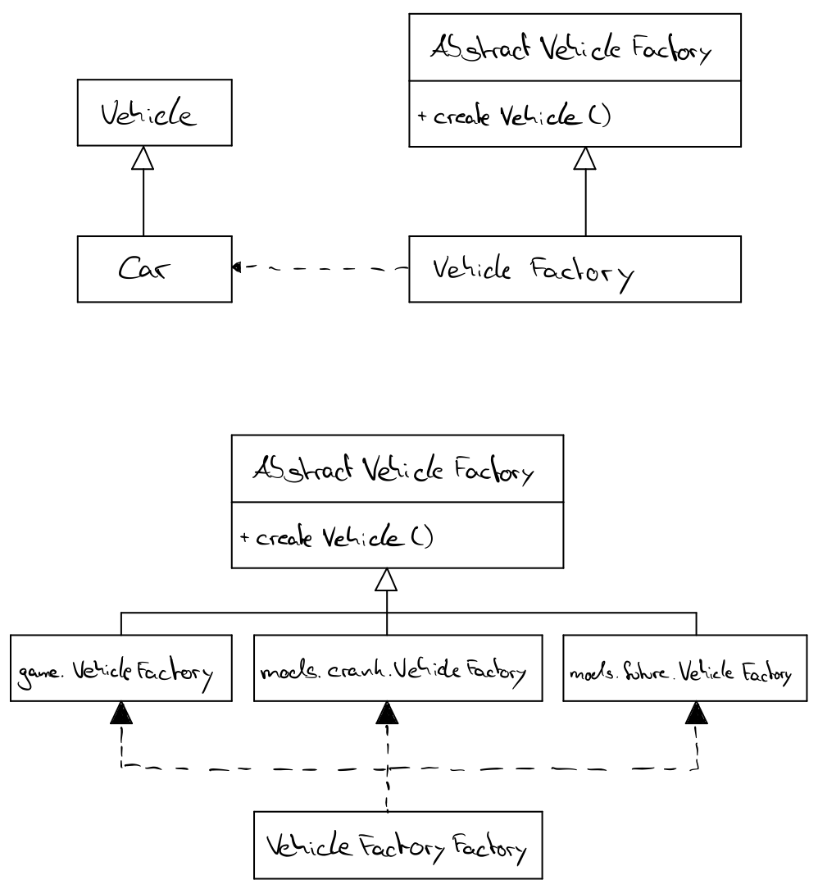

# DHBW SanPatrick
This project is an example application to show the Factory Method design pattern (DHBW - Semester 5 - Advanced Software Engineering)

  

##Scenario
Our scenario is that we have developed a game in which users are able to create a vehicle based on different terrains. In a first version only one vehicle for one terrain - a car for the road terrain - is available. To provide developers adding more vehicles for different terrains, they are able to create mods with additional vehicles. The terrains are initially defined in the first version of the game.

 

**Available Terrains:**
* Road
* Offroad
* Industrial
* Underground
* Water
* Underwater
* Sky
* Space
* Transdimensional

 

**Available Mods:**
* none
* crank
* future

  

##Test it

You can test it by compiling and running the main method from Game class.

Change mod by editing the mod.properties file.

  

##How it works

All vehicles have to implements the Vehicle interface. 

    public interface Vehicle {
        void steer();
    }
   
 

The initial game provides a AbstractVehicleFactory class:
 
    public abstract class AbstractVehicleFactory {
    
        public abstract Vehicle createVehicle(Terrain terrain);
    }
 
 This class provides the method createVehicle which should create a Vehicle based on the different terrains.

 

Each mod has to implement a VehicleFactory class extending the AbstractVehicleFactory class and override the createVehicle method. 

Example implementation in crank mod:

    public class VehicleFactory extends AbstractVehicleFactory {
        @Override
        public Vehicle createVehicle(Terrain terrain) {
            switch (terrain){
                case ROAD:
                    return new Car();
    
                case WATER:
                    return new Boat();
    
                case OFFROAD:
                    return new Tank();
    
                case INDUSTRIAL:
                    return new Forklift();
    
                default:
                    return null;
            }
        }
    }
    
 

Which mod is loaded is defined in the mod.properties file

    mod=crank
    
 

If the game is started and the user creates a car the program has to decide from which VehicleFactory the createVehicle method has to be called.

To do this the game has a VehicleFactoryFactory class.

    class VehicleFactoryFactory {
        static AbstractVehicleFactory createVehicleFactory() throws GameModNotFoundException {
            Properties modProperties = getProperties("mod");
            String mod = modProperties.getProperty("mod");
    
            String factory;
    
            if(mod.equals("none")){
                factory = "game";
            } else {
                factory = "mods." + mod;
            }
    
            factory += ".VehicleFactory";
    
            try {
                return (AbstractVehicleFactory) Class.forName(factory).newInstance();
            } catch (InstantiationException | IllegalAccessException | ClassNotFoundException e) {
                throw new GameModNotFoundException();
            }
        }
        
        ...
     }
     
The method createVehicleFactory reads the mod.properties file and than call the right class. For the crank mod:

    mods.crank.VehicleFactory

After that the vehicle can be created

    AbstractVehicleFactory factory = VehicleFactoryFactory.createVehicleFactory();
    Vehicle vehicle = factory.createVehicle(Terrain.ROAD));
    
  

##UML

  
    
##Team Members
* Patrick Härtenstein
* Andreas Kießling
* Sebastian Ott
* Stefan Schneider
